## Memory Game - Android приложение

### Упрощенная архитектура взаимодействия

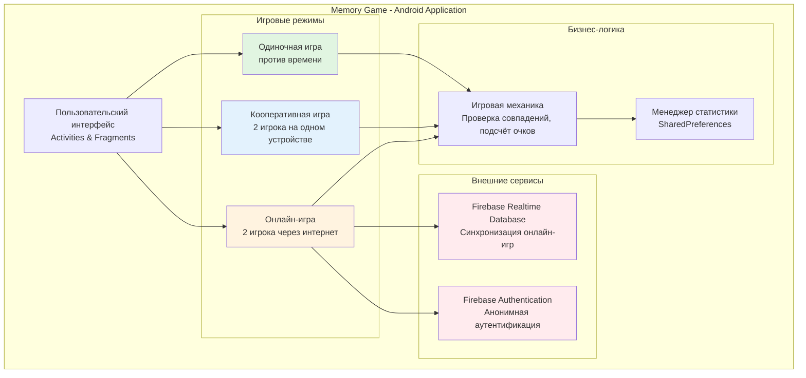

Зелёным цветом отображены игровые режимы, реализованные в приложении.

Красным цветом отображены внешние сервисы Firebase, используемые для онлайн-режима.

### Описание функционала Memory Game

**Memory Game** — мобильное приложение для платформы Android, предназначенное для тренировки памяти и внимания. Приложение реализует классическую игру "Найди пару" с поддержкой различных режимов игры.

Приложение разработано на языке Kotlin с использованием архитектурного паттерна MVVM. Минимальная поддерживаемая версия Android — 7.0 (API 24), целевая версия — Android 14.0 (API 34).

**Основной функционал:**

- Три игровых режима: одиночная игра, кооперативная игра на одном устройстве, онлайн-игра через интернет
- Три уровня сложности: 12, 16 и 20 карточек
- Система подсчёта очков и ведения статистики
- Синхронизация онлайн-игр в реальном времени через Firebase Realtime Database
- Анонимная аутентификация пользователей для онлайн-режима

**Технологический стек:**

- Язык программирования: Kotlin 1.9.0
- Архитектура: MVVM (Model-View-ViewModel)
- UI: XML Layouts, View Binding, RecyclerView, Material Design Components
- Асинхронность: Kotlin Coroutines, Flow
- Локальное хранилище: SharedPreferences
- Онлайн-синхронизация: Firebase Realtime Database, Firebase Authentication
- Система сборки: Gradle 8.2+

Исходный код доступен по ссылке: [GitHub Repository](https://github.com/BeloeColeno/MemoryGame)

---

## Демонстрация пользовательского интерфейса

### Главное меню

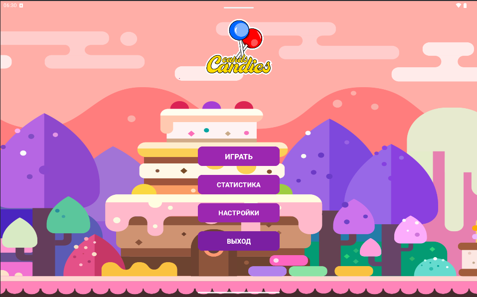

Главный экран приложения. Пользователь может выбрать режим игры, просмотреть статистику или перейти в настройки.

### Выбор режима игры

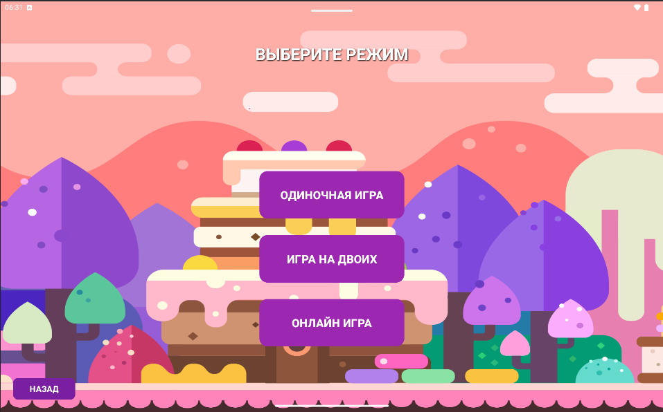

Экран выбора режима игры. Доступны три режима: одиночная игра, кооперативная игра и онлайн-игра.

### Одиночная игра

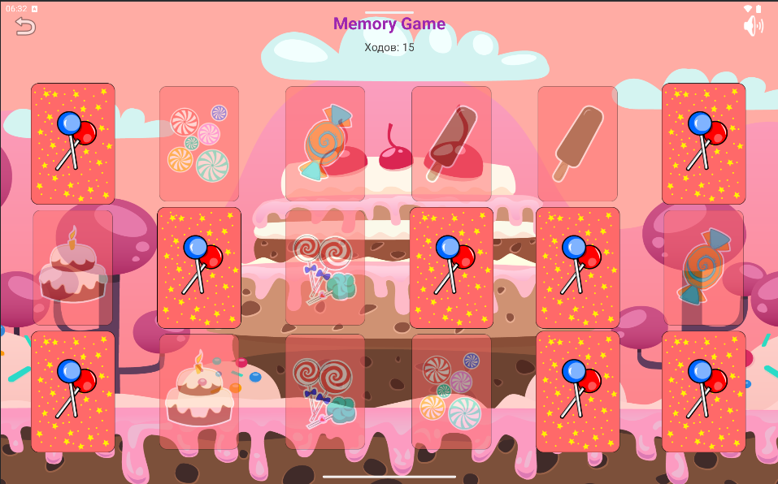

Режим одиночной игры. На экране отображается сетка карточек, таймер и счётчик найденных пар. Игрок переворачивает карточки, пытаясь найти совпадающие пары до истечения времени.

### Кооперативная игра

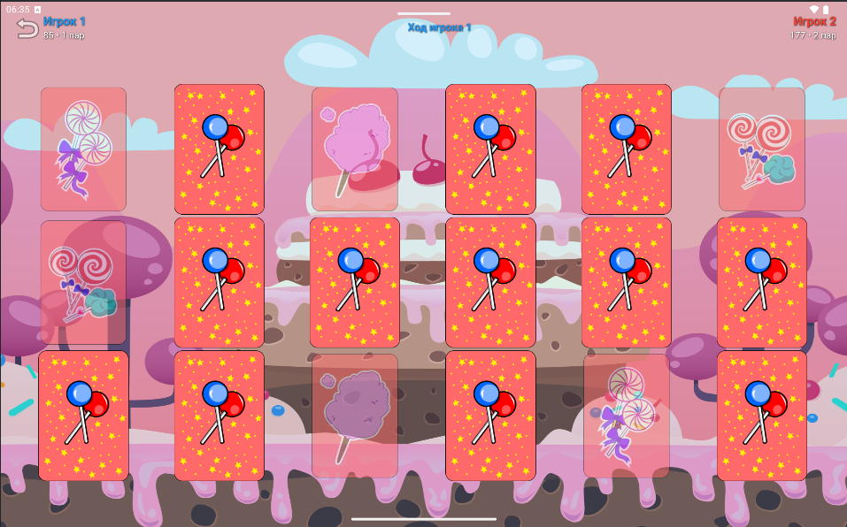

Режим кооперативной игры для двух игроков на одном устройстве. На экране отображается индикация текущего хода (синий фон для Игрока 1, красный для Игрока 2), счётчики найденных пар для обоих игроков. При нахождении пары ход остаётся у того же игрока, при промахе переходит к сопернику.

### Онлайн-режим: Лобби

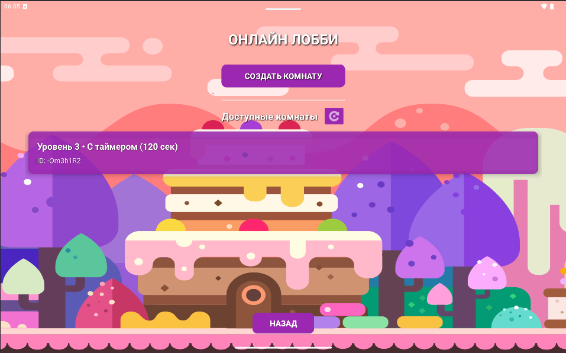

Лобби онлайн-игры. Игрок может создать новую игровую комнату или присоединиться к существующей. Отображается список доступных комнат с информацией об уровне сложности и режиме таймера.

### Онлайн-режим: Комната ожидания

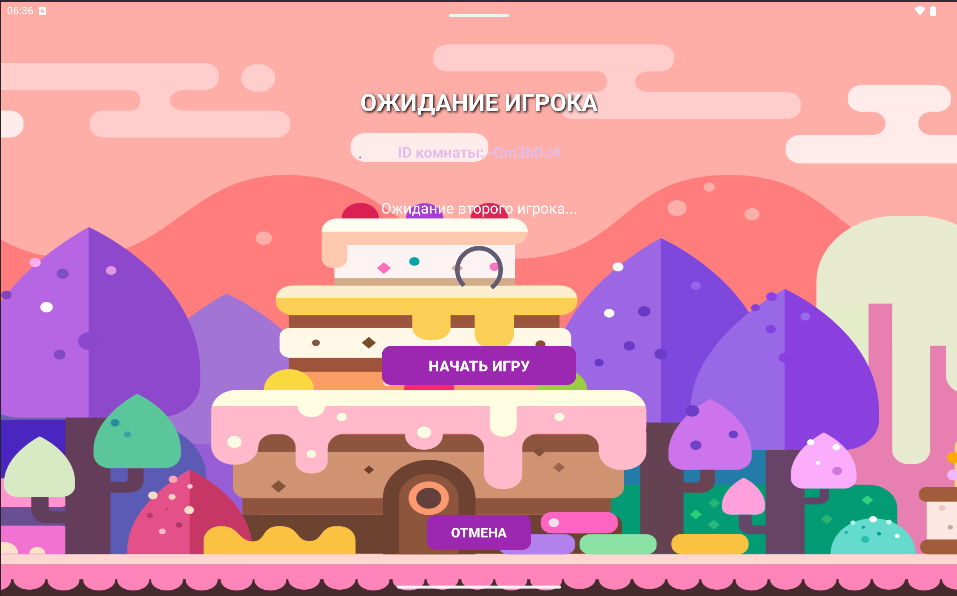

Комната ожидания после создания игры. Отображается ID комнаты, который нужно передать второму игроку. Хост ожидает присоединения второго игрока и может начать игру кнопкой "Начать игру".

### Онлайн-режим: Игровой процесс

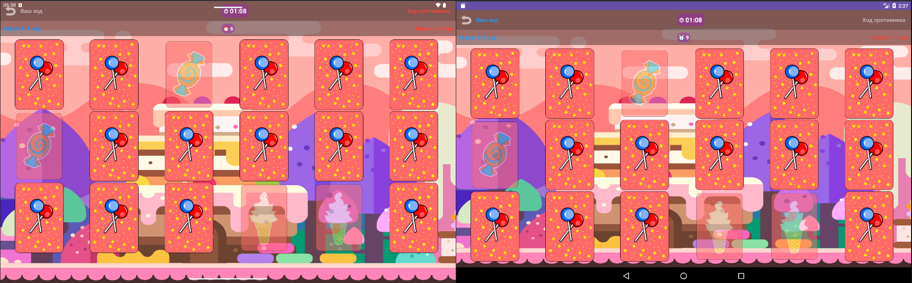

Игровой процесс в онлайн-режиме. Все действия игроков синхронизируются в реальном времени через Firebase. Отображаются счётчики обоих игроков и индикация текущего хода. Время синхронизации действий составляет менее 1 секунды.

### Результаты игры

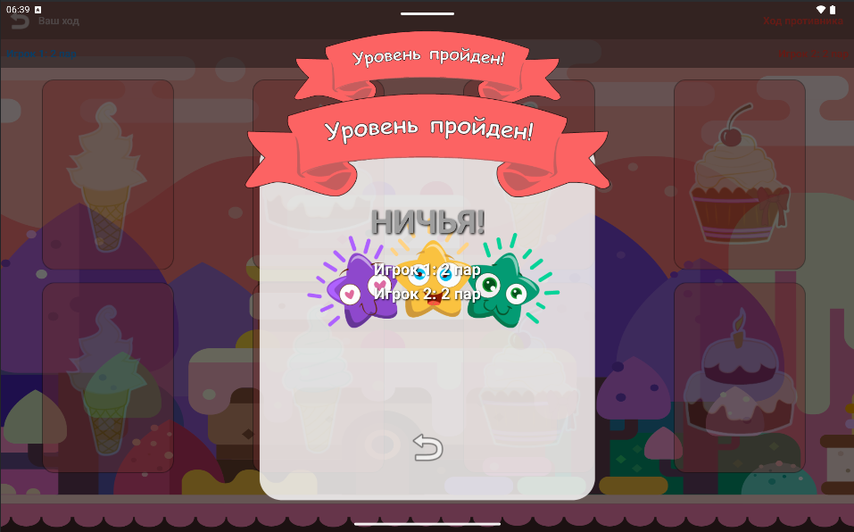

Экран с результатами игры. Отображается победитель, количество найденных пар каждым игроком, затраченное время. Результат сохраняется в статистику.

### Статистика

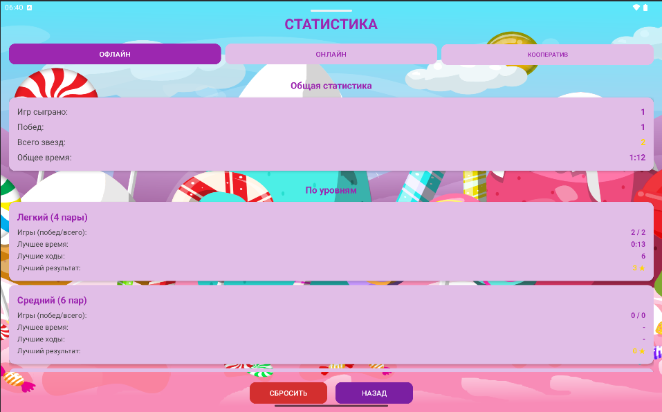

Экран статистики. Отображается общее количество сыгранных партий, количество побед, процент побед, лучшее и среднее время прохождения для каждого режима игры. Статистика ведётся отдельно для одиночного, кооперативного и онлайн-режимов.

---

## Схема взаимодействия в онлайн-режиме

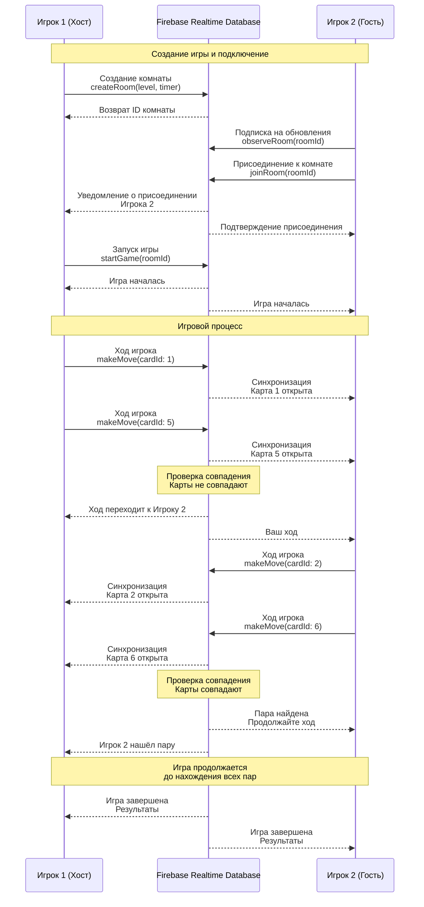

Синхронизация между клиентами происходит через Firebase Realtime Database. При каждом действии игрока данные отправляются в Firebase, который автоматически уведомляет всех подписанных клиентов об изменениях. Время синхронизации составляет менее 1 секунды благодаря использованию WebSocket соединений Firebase.

---
